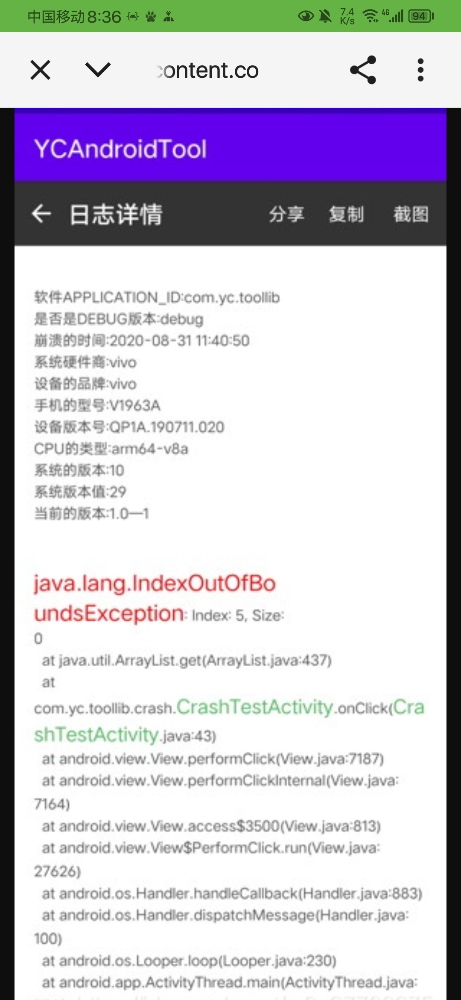

# My English is not good,so all the following contents are translated by Google.

# GooseDroid
Desktop Goose but for Android

I use the AI convert [https://github.com/arkangel-dev/desktop-goose-source](https://github.com/arkangel-dev/desktop-goose-source) C# code to Java code to complete this project.

# An error occurred?
First, please check whether you have opened all permissions for the app. If so, do the following.

Create an issue with:

1. The complete process video of the app when an error occurs.
2. If there is the following UI, it contains the log file like this:

# AppPreview
[Check it out on bilibili](https://www.bilibili.com/video/BV1aBwce9E2c/)

[Check it out on YouTube](https://youtu.be/wPkmbBTZKfQ?si=QN6ilgISKMiP9yCr)
